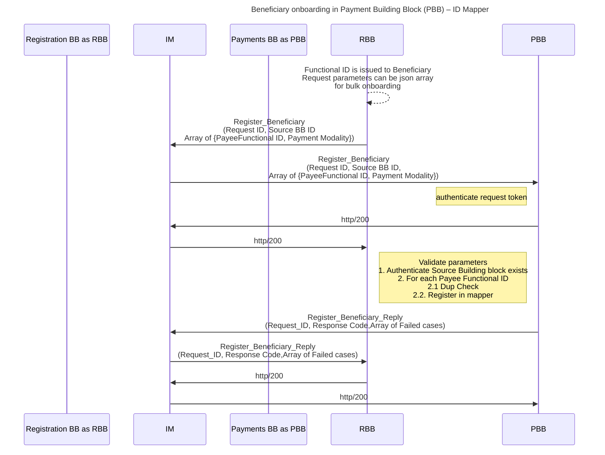
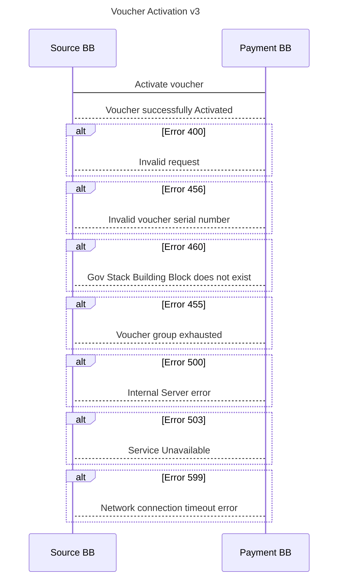
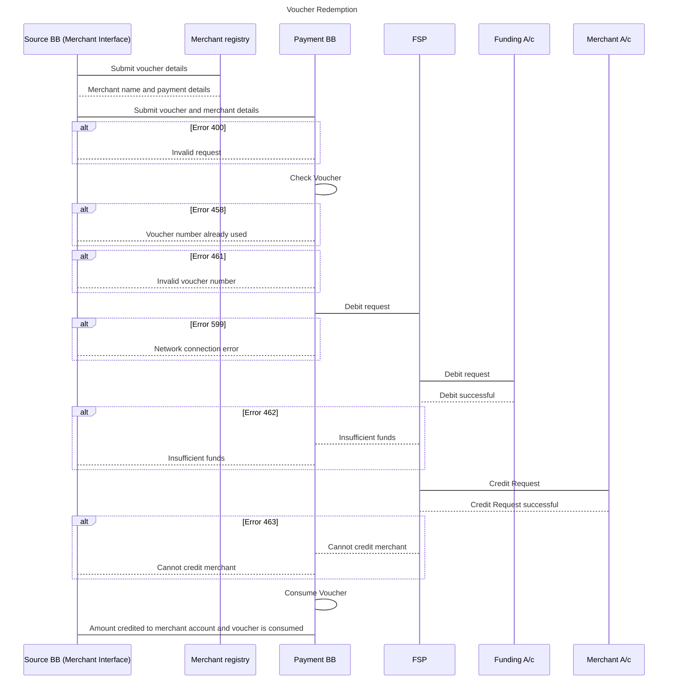
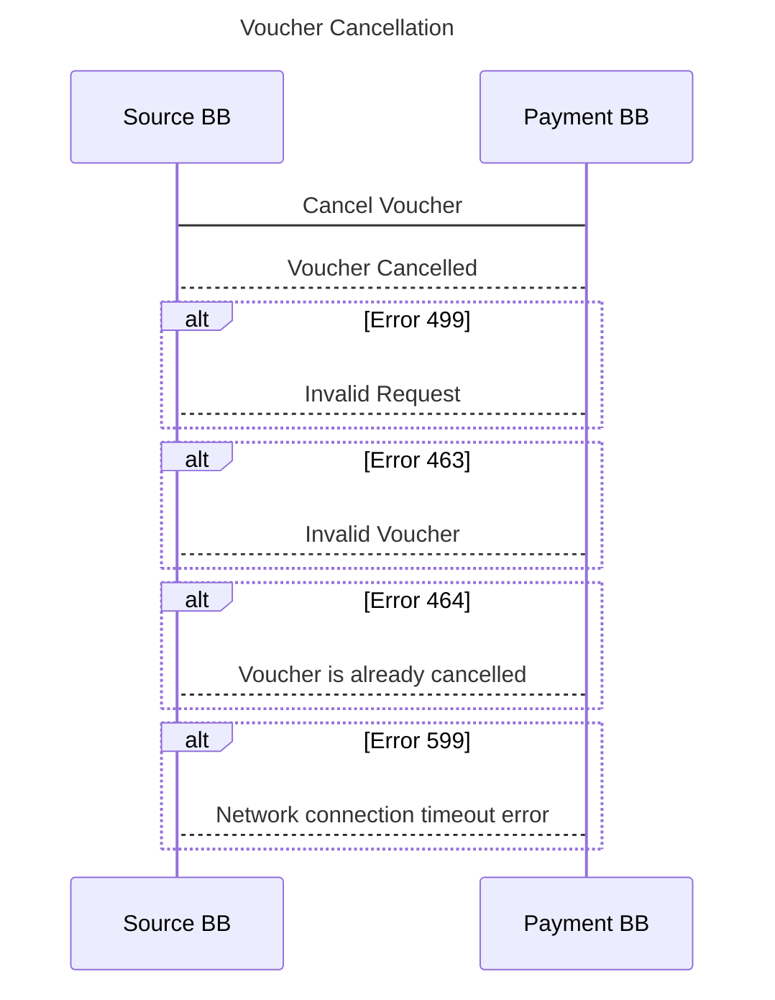
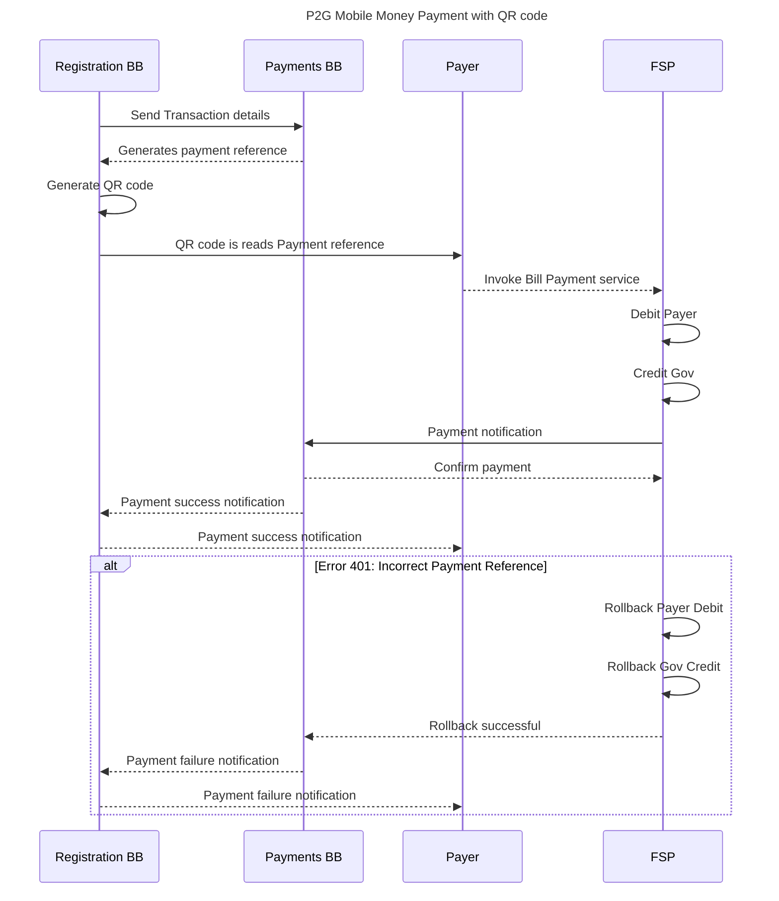
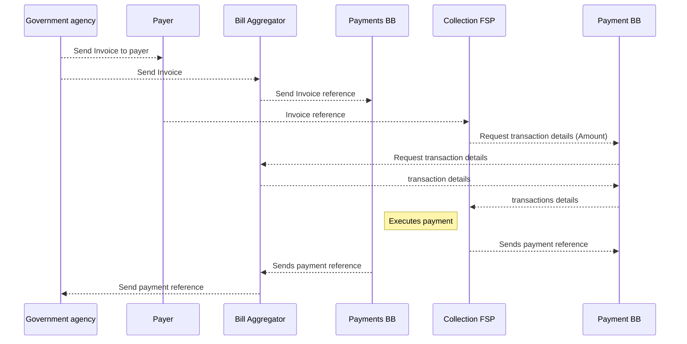
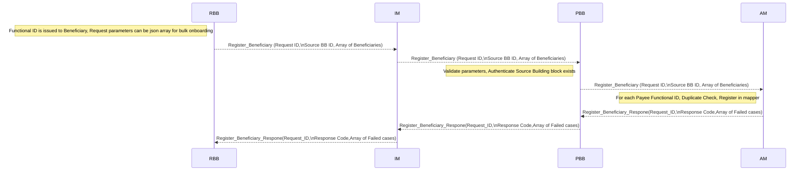

# 9 Internal Workflows

## 9.1 G2P Bulk Payment Workflow 

**9.1.1 Sequence Diagram**

The sequence diagram shows the flow of data between Building Block for bulk payments workflow.

* The Beneficiary system (Registration Building Block) transmits the compiled list with boundary conditions for payment timings for each G2P programme (i.e. staggered, each week, standing, etc.).
* The beneficiary is paid and the success is communicated back to the Beneficiary system (as well as error codes).
* Financial Services Provider (FSP) notifies the end beneficiary who then requests the payment via a channel (Merchant POS, Agent, mobile banking, wallet account feature, bank transfer, voucher).
* Bulk payment service sends the batch to each Financial Service Provider with payment instructions.
* Financial Service Provider returns a quote on the fees to be charged.
* In the case of salary payments, there is a single entry in the payment instruction file sent to the bulk payments service.
* Bulk payment service prepares the batch breakdown on the basis of rulesets governing which Financial Service Providers shall receive which payments, combining payments with other payments to the same beneficiary, etc.
* Financial Service Provider validates that the account exists and provides the status of the account.
* Bulk payment service uses the Account Lookup (Directory) Service (ALS), a type of Discovery Service that is more protective of account information and privacy. The ALS is used to establish the destination Financial Service Provider, and the payment alias is then provided by the destination Financial Service Provider. These functions are used when the account address is not specified in advance. The discovery service can also be used to verify whether the account address information provided by the beneficiary system is valid (this would be in the event the payment information is provided by the beneficiary system to the Payments Building Block directly).
* Bulk payment services validate data structures and content in compiled lists.
* Bulk payment service system does reconciliation on accounts paid/not paid and communicates that back to the beneficiary system as well.

#### 9.1.2 Disbursement to Beneficiary Using Mobile Money 

In order to facilitate the transfer of funds from the disbursement organisation (the payer) to the mobile money provider, the mobile money provider would need to be connected to the payment gateway/switch. Should this connection not be in place, the disbursement could be facilitated by a third-party aggregator or there would need to be a bilateral connection between the payer’s Financial Service Provider and the Mobile Money Provider.

#### **9.1.2.1 Interaction with Other Building Blocks**

This workflow requires interaction with the registry Building Blocks.

The disbursement organisation (payer) gives instruction to its Financial Service Provider to process a bulk disbursement to a number of mobile money recipients (Healthcare workers).

The payer’s Financial Service Provider forwards the bulk payment instructions to the Bulk payment service which validates the list and queries the ID directory service to determine the recipients' mobile money providers. The ID directory returns the list of the recipients' providers to the Building Block which would then create separate batches for each mobile money provider.

The bulk payments service sends the batch and payment instructions to the payer’s Financial Service Provider which processes the transfer through the gateway that forwards the payment to the correct Mobile Money Provider.

The Mobile Money provider would then credit the beneficiaries' accounts who would receive a notification, confirming the amount has been credited to their accounts. Upon payment success, the Mobile Money provider would notify the payer’s Financial Service Provider of the payment completion.

## 9.2 G2P Beneficiary Payments Using Vouchers

The Voucher Management System supports three workflows for voucher payments:

1. administration (voucher provisioning and merchant registration),
2. voucher issuing (pre-activation and activation),
3. redemption use cases as shown in the diagram below.&#x20;

These use cases and the relationship between each one of them are shown and further described below.

The use cases are described in the section below:

#### **9.2.1 Voucher administration**

These processes are usually done prior to the issuance of the voucher to ensure a smooth flow at the point of issuance.

The Admin processes for the Voucher Management Server cover the lifecycle of the vouchers and are typically performed by a privileged user (this may be done through User Interface or an API). These processes include but are not limited to creating voucher groups, provisioning vouchers, suspending vouchers, unsuspending vouchers, validating vouchers, key management, and purging of used vouchers.

* Voucher Provisioning\
  This function will be done by an administrator (privileged user). It will typically be triggered by the deposit of funds in a funding account, thus the source account. Voucher provisioning creates a conditional right to funds and an inventory of issued vouchers. Other processes related to this are voucher inventory management, voucher suspension, and voucher purging.
* Merchant Registration\
  In order for efficient redemption of vouchers merchants MUST be registered in advance to create a network of trusted providers. This registration is assumed to be managed by the Registration Building Block, The account verification of the merchant can be done at registration or during redemption subject to a configuration.\
  \
  During the registration process, merchants MAY also be assigned to different voucher groups depending on the required function that has been implemented. For example, there may be a voucher group for schools. This implies that vouchers of this type can only be redeemed at schools. This also requires that the user flow system at which the voucher is issued is aware of these voucher groups and is able to send the appropriate request to the Voucher Management System.
* Agent Registration\
  In markets where cashouts are being used, it is expected that the Registration Building Block will register agents in a similar way.
* Voucher Groups\
  Depending on the requirement it should also be possible to set up multiple voucher groups. Vouchers in the same voucher group will have similar characteristics and are labeled with a specific voucher group name. During voucher provisioning, a voucher can be created and attached to a single voucher group. When a voucher is requested (using the pre-activation API) it is expected that the voucher group will be one of the parameters set.
* Voucher Issuing\
  Voucher issuing is triggered by the Registration Building Block which will determine whether the conditions of issuance have been met. The calling Block will determine the denomination and voucher group of the voucher to be issued. The voucher number and the voucher serial number that is issued can be presented to the beneficiary in multiple ways including but not restricted to encoding in the form of QR codes, bar codes, printed vouchers, or even SMS. This is outside the scope of the Payments Building Block. It is expected that Building Blocks through which the voucher is redeemed will also be able to decode the voucher.

**9.2.2 Voucher Activation sequence diagram**

The voucher activation flow is shown in the diagram below.

Flow Description:

* An external Building Block may invoke the Payments Building Block API gateway to pre-activate API on the Voucher Management Server with the amount of the voucher, the voucher currency, and the voucher group. The calling Building Block may optionally send a comment. The comment will be stored by the voucher server. The voucher group will indicate that it is looking for a voucher from a specific voucher group. This API call will be made through the Payments orchestrator.
* The voucher group is typically used for conditional social transfer (e.g. for school fee payment). If any voucher can be used for any purpose, then all vouchers should be created with a generic voucher group (e.g. “GENERAL-PURPOSE”).
* The API returns to get a voucher number, the voucher serial number, and its expiry date. At this point, the voucher will be flagged as Pre-Activated.
* The calling Building Block may render the voucher as a QR code, as a barcode, or even as an SMS text. It is recommended that the voucher should include supplementary data of the recipient. It is also recommended that this data should also be printed in human-readable form so that the recipient can verify the data on the voucher. This data can also be verified at the point of redemption.
* Once the calling API successfully prints/issues the QR code, the voucher can then be activated using the activation API. It is assumed that there will not be a substantial delay between pre-activation and activation to necessitate the need for multiple expiry periods.

Alternative: the voucher could be activated immediately on being requested. This could be controlled at the Payments Orchestrator.

* Preconditions
  * The calling registration block will determine that all the necessary preconditions are met.
  * The most critical precondition is the prefunding which will be done manually at the voucher provisioning stage. Other options that could be prefunding triggered by activation or at redemption are not considered because they are considerably more complex and create additional failure points in the activation of the vouchers.
* Assumptions/Queries
  * It is assumed that only one currency will be used.
  * A zero-trust architecture.
  * The transaction is not reversible.
* Post-Condition\
  The calling Building Block may invoke another payment Building Block API, e.g. initiating an incentive payment for the agent.

**9.2.3 Voucher Redemption sequence diagram**

The voucher redemption process is shown in the diagram below.

Flow Description:

* At redemption, the beneficiary shows the voucher to the merchant or agent.
* The merchant/agent will scan and interpret the medium in which the voucher is presented (this could be a QR code or a barcode or an SMS or even a printed number).
* Voucher redemption Validation: The details presented MAY allow the merchant/agent to authenticate/validate the owner of the voucher.
* The agent will then initiate the redemption process which will call the Payment Building Block API Management Gateway.
* The API Management Gateway will validate the voucher and initiate the payment through the payment gateway.
* If specific voucher groups have been set up, voucher usage may be restricted to specific merchants. An override parameter should also be provided that will allow a Voucher of any voucher group to be redeemed at any merchant.
* Once the payment to the merchant/agent is successful the Payment gateway will inform the API Management Gateway.
* The API Management Gateway will then instruct the VMS API to flag the voucher as consumed.

Alternatives:

* Payments could be made through a switch in which case there would be no need for prefunding accounts in each financial institution.

Preconditions:

* The merchant must have been registered possibly by the Registration Building Block with their preferred payment method.
* The merchant must have a mechanism (e.g. a mobile APP, USSD app, or SMS option) to verify the beneficiary prior to redemption.

Assumptions:

* The app for reading the QR code and redemption is not part of the scope of the Payment Building Block.
* The entire voucher amount is consumed. Partial redemption will not be allowed.
* The amount that is paid to the merchant or agent is debited from a prefunded account.

**Sample Redemption**

.png>)

Note:

In the case of a physical voucher, the voucher number or the secret number is hidden behind some material that must be scratched away to see the number. The voucher number is also commonly known as the PIN.

**9.2.4 Voucher Cancellation sequence diagram**

The voucher cancellation flow is shown in the diagram below.

Flow Description:

* The calling Building Block will request the API Management Gateway to cancel a Voucher.
* The API Management Gateway will invoke the VMS API to cancel the Voucher.
* The Vaucher Management System (VMS) API interface will check if the Voucher is valid and then cancel the Voucher.
* The VMS API interface will confirm that the Voucher has been canceled.

Alternatives:

* If the Voucher does not exist, the VMS API will respond that the Voucher does not exist.
* If the Voucher is already consumed, the VMS API will respond that the Voucher is already consumed.
* If the Voucher is already canceled the VMS API will respond that the Voucher is already canceled.
* If the Voucher is suspended the VMS API will respond that the Voucher is suspended.

**9.2.5  Voucher Technical Requirements**

| **Requirement**                                             | **Type (Must/Should/May)** |
| ----------------------------------------------------------- | -------------------------- |
| Voucher Provisioning                                        | MUST                       |
| High volume generation of vouchers                          | MUST                       |
| Voucher numbers must be unique and not predictable          | MUST                       |
| Logs must not capture voucher numbers                       | MUST                       |
| Voucher Storage (will this be in a separate Building Block) | MAY                        |
| Secure storage                                              | MUST                       |
| High Availability                                           | MUST                       |
| Issuance                                                    | 
 MUST
            |
| API invoked to get voucher number and serial number         | MUST                       |
| Redemption                                                  |                            |
| API to redeem voucher                                       | MUST                       |
| API to invoke payment gateway                               | MUST                       |

* All calls from external parties (e.g. Registration Building Block) to the voucher management system will be initiated through the API management gateway.
* The payment orchestration module may direct transitions between the various functions.
* The discovery service could be called by other building blocks to determine where bank accounts/wallets sit.
* The only function that speaks to the DFS is the payment gateway. Any function that needs to speak to the DFS goes through the Payment gateway.
* The Payment gateway may need to speak to a Number Portability provider.
* Audit trails (transaction logs) capture each event as it happens and are to be used for queries, analysis, and reconciliation.
* Event logs will capture specific events that happen at each node.

## 9.3 P2G Payments

The following types of P2G payments are considered.

A) Bill payments

B) Payments for government services (application for a birth certificate)

C) Payment for registrations. ([Registration for Postpartum and Infant Care](https://github.com/GovStackWorkingGroup/BuildingBlockAPI/issues/1))

### 9.3.1 P2G Payment Upon Registration for a Government Service

There are two possible scenarios that can be supported:

a) P2G payment is initiated by the Payer

b) P2G payment is initiated by the Payee (USSD push payment for example)

Scenario a) can also be implemented using QR code.

9.3.1.1 P2G Payment initiated by the payer

General Notes:

* It is assumed that all APIs used are real (sync or async).

.png>)

Flow Description:

* Upon registration for a government service, the Registration Building Block sends transaction details to the Payments Building Block which creates and returns a unique payment reference for the payer of the service.
* The Registration Building Block sends the unique reference number to the payer.
* After entering their account the payer would invoke a bill payment to a selected service (in this case paying for the registration service). The payer would need to enter the payment reference which would prompt the retrieval of the payment details from the Registration Building Block in real time. If the payment details are correct, the payer is prompted to enter their mobile money pin to authorize the payment.
* Upon authorisation, the payer’s account is debited and the government’s connected account is credited in real time. The Financial Service Provider, in this case, the mobile money provider would then notify the success status of the Payments Building Block.
* For this type of payment, as the payment reference is needed to validate the payment, this can be done by any mobile money account holder.

Notes:

The above model requires that the payer must provide two pieces of information through their USSD, STK, or mobile app:

* A merchant ID. Typically the government would be given a special merchant ID. The payer should be able to select which government service they would be paying for through the mobile money interface.
* A reference ID: this is unique and time bound for each transaction.
* As the bill payment is invoked by inputting the reference number which prompts the retrieval of the payment details in real-time from the registration building block, a failed transaction could be triggered by a session time-out or a wrong PIN. In both cases, the payer would have to re-initiate the transaction.
* In the P2G payment in the flow above, the government holds an account with the Financial Services Provider which would collect the payments on the government's behalf and transfer them to the single treasury account on a defined timeline (i.e. daily) in an aggregated way. For reconciliation purposes, the Registration Building Block would need to notify the government of a successful/unsuccessful payment.

### 9.3.1.2 P2G Payment Initiated by Payee (e.g USSD push payment) sequence diagram

Flow Description:

* Upon registration for a government service, the registration building sends transaction details to the Payments Building Block which sends a payment request to the payer through their mobile money provider (Unstructured Supplementary Service Data prompt).
* The payer will see a request coming for the specific service requested with payment details, prompting them to authorize the payment by entering the pin code.
* Upon authorisation, the payer’s account is debited and the government’s connected account is credited in real time.
* The Financial Services Provider, in this case, the mobile money provider would then notify the success status to the Payments Building Block.
* This payment differs from the previous P2G mobile money payment as the payment is not initiated by the payer by invoking a bill payment but is initiated by a merchant (in this case the government agency providing the service). Therefore the payer is requested to pay for the service immediately.

Notes:

* There can be no error in the above as both the merchant number and the payment reference are pushed to the phone.
* The only risk here is a timeout on the Unstructured Supplementary Service Data or the user keying in the wrong PIN which may require the transaction to be reinitiated.

### 9.3.1.3 P2G Payment implementation using QR Code sequence diagram

Notes:

* There is small room for error in reading a QR code (unless the payer scans the wrong code).
* All mobile operators and banking apps need to be able to read the reference in the same way for this to work meaning that a standardised/interoperable QR code needs to be in place at a country level. While this is in place in some Asian countries (i.e. Indonesia, Sri Lanka) where there is widespread adoption of QR codes, In Africa the uptake of QR codes is significantly lower and standardisation is typically not in place at a country level.
* During registration, the Registration Building Block will generate transaction details including the amount to be paid by the payer and transaction ID, and send them to the Payments Building Block.
* The Payments Building Block will use the transaction details to initiate a request to pay to the Financial Service Provider.
* The QR payment widget displayed to the payer will have the following different attributes: payment\_entity\_id, amount, currency, transaction\_id
* The payer scans the QR code to approve/reject the payment.
* The Financial Service Provider sends a notification of the status of the transaction to the Payments Building Block and the payer.
* Transaction status is sent to the Registration Building Block on completion of payments.
* The Messaging Building Block sends a transaction confirmation message to the payer.

### 9.3.2 Bill Payments

### &#x20;  &#x20;

1. The Government Agency sends the invoice to the payer through the initiating DPG that initiated the transaction. The Invoice contains the data detailed in the header and multiple elements containing the fee, duty or tax details. The data model of the invoice is in the tables to the right.
2. Simultaneously with step 1, the Government Agency sends the invoice to the Bill Aggregator BAn through the initiating DPG that initiated the transaction. Because many Bill Aggregators exist BAn Is the Bill Aggregator identified uniquely BA1, BA2… the Invoice contains the data detailed in the header and multiple elements containing the fee, duty or tax details. The data model of the invoice is in the tables to the right.
3. Bill Aggregator sends the invoice reference to the Payment BB with the data model in the table to the right.
4. The payer requests to pay at his preferred FSP by indicating his invoice reference.
5. The FSP system requests the invoice details from the Payment Building Block indicating the invoice reference.
6. The Payment BB requests the invoice details from the Bill Aggregator BAn Block indicating the invoice reference and using the previous routing information received in step 3.
7. The Bill Aggregator BAn Block sends the Invoice details requests the invoice data to the Payment Building Block (refer to previous slide for details Invoice data model same as step 1).
8. The Payment BB sends the Invoice details requests the invoice data to the FSP (refer to previous slide for details Invoice data model same as step 1 ).
9. The FSP executes the payment by transferring the associated amounts to the associated accounts per tax/duty or fee type using the “Routing accounts details” table (data model detailed to the right).
10. The FSP Sends the “Payment Reference details” (Data model detailed to the right) to the Payment Building Block.
11. The Payment Building Block sends the “Payment Reference details” to the Bill Aggregator BAn.

### 9.4 Beneficiary Onboarding in Account Mapper

