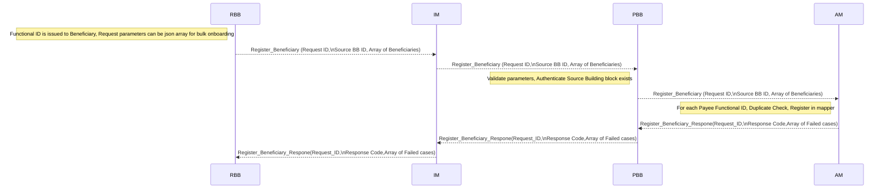
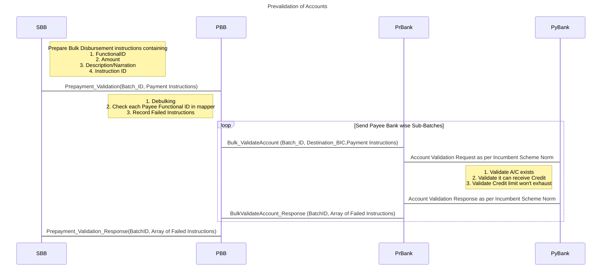
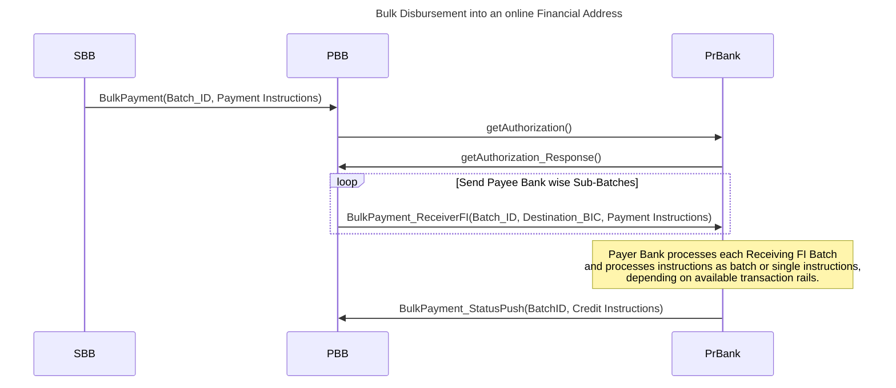
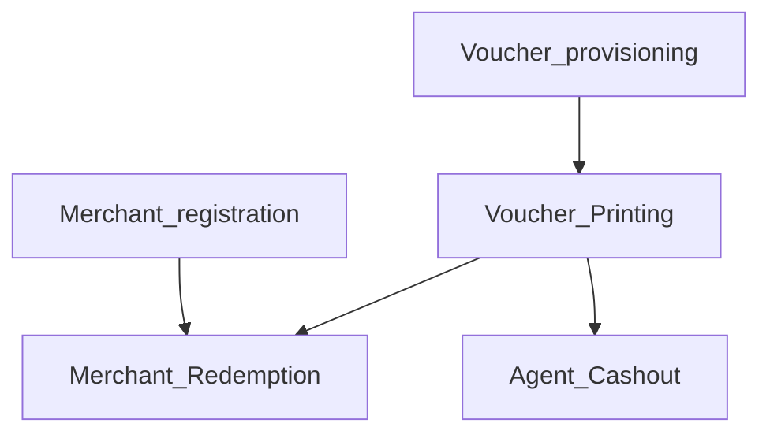
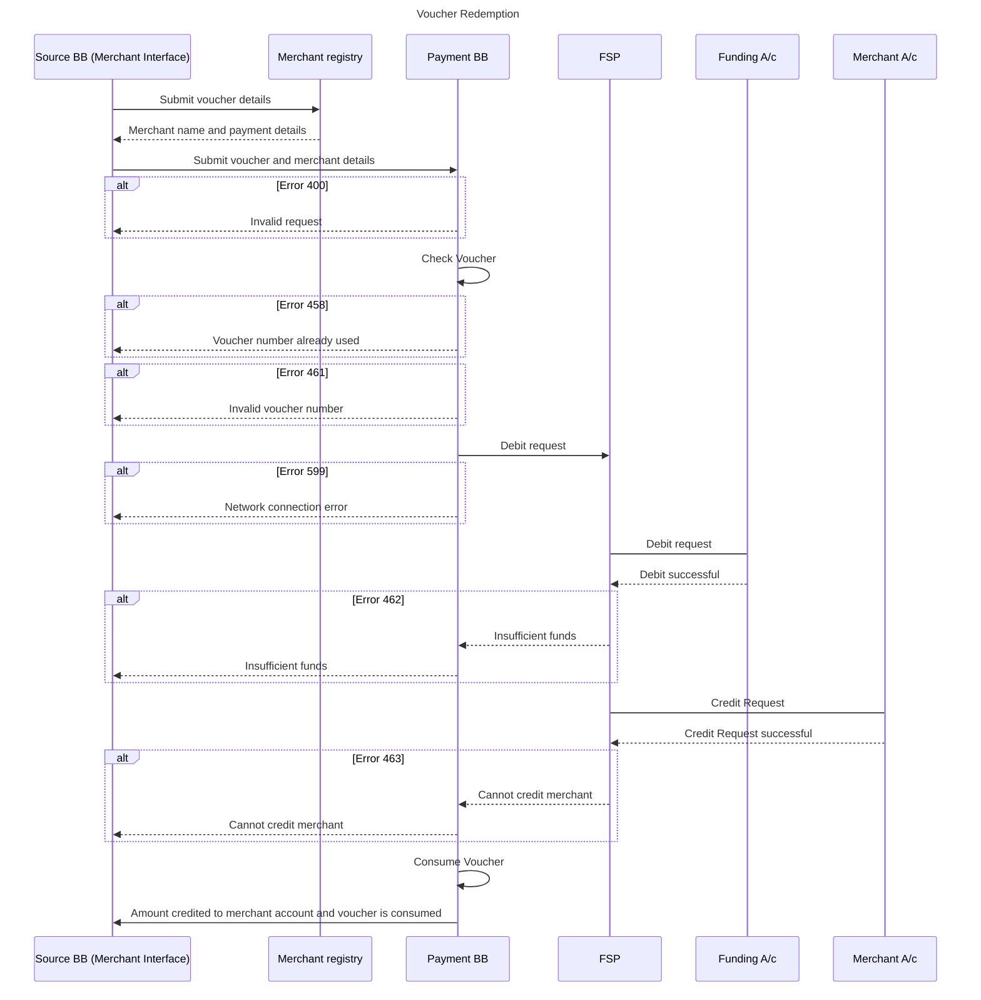
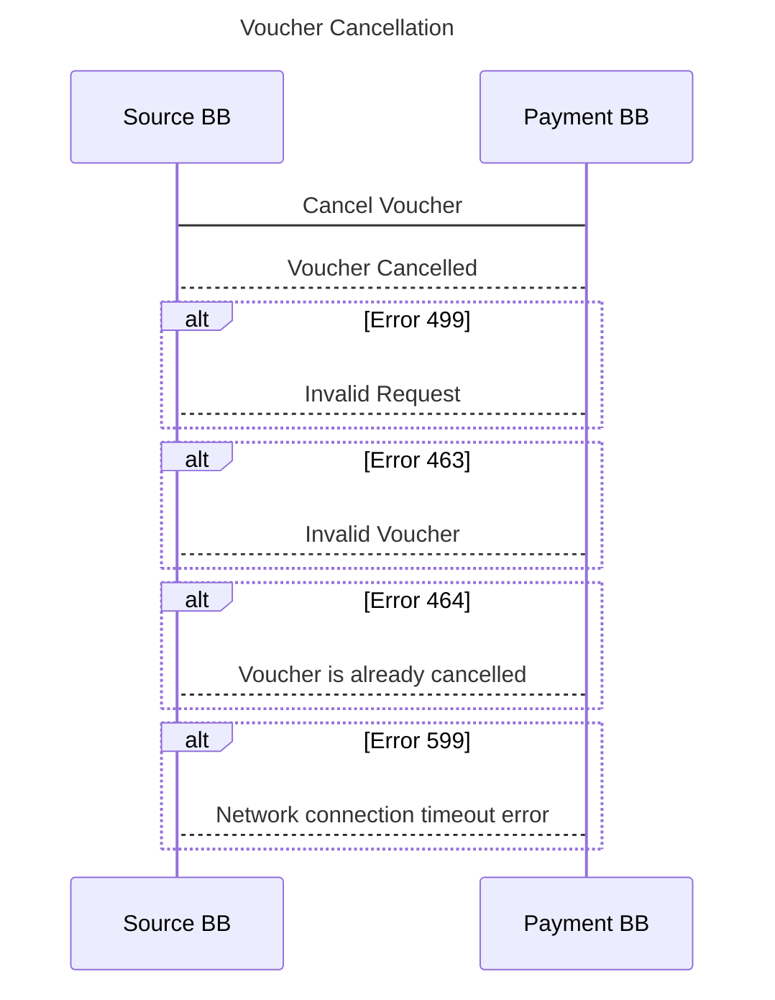
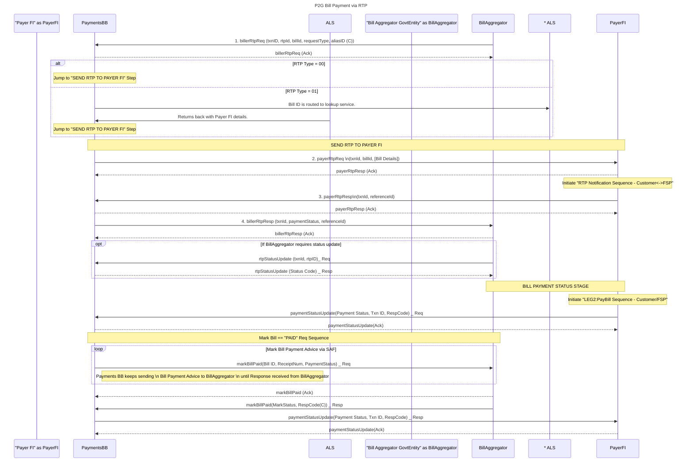
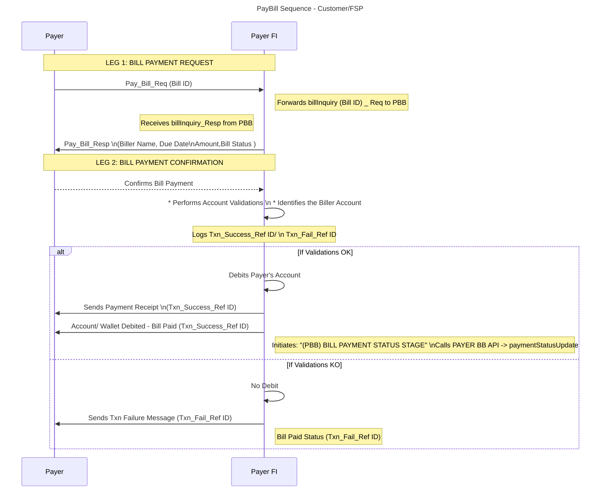
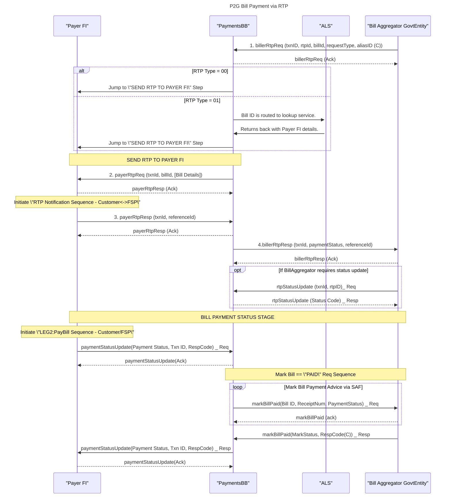
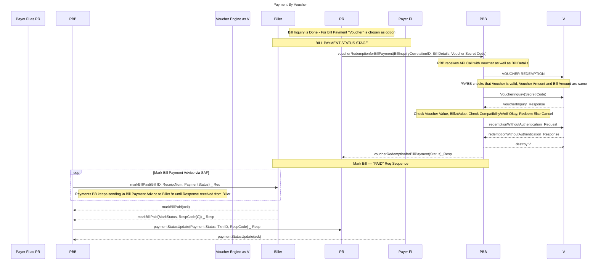

# 9 Internal Workflows

## 9.1 G2P Bulk Payment Workflows 

This section discusses the various processes involved in G2P disbursement, such as beneficiary onboarding into the Account Mapper, bulk disbursements to pre-registered financial addresses, and account pre-validation prior to bulk disbursement.

### 9.1.1 Beneficiary Onboarding in Account Mapper

The workflow represents the process of onboarding beneficiaries in the ID Mapper as a prerequisite step before any payment processing can occur. This use case is triggered when a new G2P beneficiary has been onboarded by a G2P program, assigned a Functional ID, and verified as eligible for the social benefit program.

1. The Requesting Building Block (RBB) sends a "Register\_Beneficiary" request to the Information Mediator (IM), containing the Request ID, Source Building Block (SBB) ID, and an array of beneficiaries with their Functional ID, Payment Modality, and Financial Address (if available).
2. IM forwards the "Register\_Beneficiary" request to the Payments Building Block (PBB) with the same parameters.
3. PBB validates the API parameters and checks if the Source Building Block is configured in the Payments BB as an acceptable source of the API call.
4. If the parameters are valid, PBB sends the "Register\_Beneficiary" request to the Account Mapper (AM) with the same parameters.
5. Account Mapper checks for duplicate Functional IDs registered by the same Source Building Block and registers the beneficiaries in the mapper if they are not already registered.
6. Account Mapper sends a "Register\_Beneficiary\_Response" to PBB, which contains the Request ID, response code, and an array of failed cases (if any) with descriptions.
7. PBB forwards the "Register\_Beneficiary\_Response" to IM, with the same parameters.
8. Finally, IM sends the "Register\_Beneficiary\_Response" to RBB, providing the final response code and the list of any failed cases with descriptions.

The workflow supports the addition of beneficiaries in the mapper in bulk. The source building block can use the same APIs for individual or bulk onboarding.

### 9.1.2 Pre-validation of Accounts prior to Bulk Disbursement

This flow represents the prevalidation process of accounts in a bulk disbursement scenario. The process involves a Source BB (SBB), Payments BB (PBB), Payer Bank (PrBank), and Payee Bank (PyBank).

1. The process begins with the Source BB (SBB) preparing bulk disbursement instructions containing key information such as the Functional ID, amount, description/narration, and instruction ID.
2. SBB sends these instructions as a prepayment validation request (Prepayment\_Validation) to Payments BB (PBB).
3. Upon receiving the request, PBB performs several actions, including debulking the instructions, checking each payee's Functional ID in the mapper, and recording any failed instructions.
4. PBB then sends payee bank-wise sub-batches for validation in a loop. For each sub-batch, PBB sends a bulk validate account request (Bulk\_ValidateAccount) to the Payer Bank (PrBank), including the batch ID, destination BIC, and payment instructions.
5. PrBank forwards the account validation request to the Payee Bank (PyBank) as per the incumbent scheme norm.
6. PyBank performs several validation checks, such as confirming the account exists, verifying that it can receive credit, and ensuring that the credit limit won't be exhausted.
7. PyBank sends an account validation response back to PrBank, adhering to the incumbent scheme norm.
8. PrBank then sends a bulk validate account response (BulkValidateAccount\_Response) to PBB, containing the batch ID and an array of any failed instructions.
9. Finally, PBB sends a prepayment validation response (Prepayment\_Validation\_Response) to SBB, including the batch ID and an array of any failed instructions.

This flow ensures that the accounts involved in a bulk disbursement transaction are valid and capable of receiving the specified credits before processing payments, reducing the risk of failed transactions and improving overall efficiency.

### **9.1.3** Bulk Disbursement into a Financial Address pre-registered in the Account Mapper

The workflow depicted below illustrates the process of bulk disbursement into financial addresses, such as bank accounts or mobile wallets, that are pre-registered in the Account Mapper. This use case is triggered when the Source BB submits a batch for processing of payments to the Payments BB.

Pre-conditions: Functional IDs intended to be recipients of funds must be pre-registered in the Account Mapper. All the financial addresses must be validated before a payment is disbursed.

Data Inputs: Source BB provides relevant confirmation to the Payments BB to begin credit transfer for successfully pre-validated accounts.

1. The process starts with Source Building Block (SBB) sending a BulkPayment request containing a Batch\_ID and a set of payment instructions to the Payment Building Block (PBB).
2. PBB checks if liquidity was provisioned before this batch is executed and if sufficient liquidity was provisioned. If this is the case, PBB proceeds to de-bulk crediting batches by the receiving institution.
3. PBB then requests authorization from the PrBank by sending a getAuthorization() message.
4. PrBank responds with a getAuthorization\_Response() message, granting the required authorization to PBB.
5. PBB begins sending payee bank-wise sub-batches to PrBank in a loop. For each sub-batch, PBB sends a BulkPayment\_ReceiverFI message containing the Batch\_ID, Destination\_BIC, and payment instructions.
6. The Payer Bank (PrBank) executes these batches through existing rails.

Exceptions: Some accounts might have been pre-validated or part of the crediting batch but cannot be credited by the payee bank for some reason. For such accounts, funds must be returned to the payer bank and credited back into the Source BB's Settlement Account through a separate process.

In order to facilitate the transfer of funds from the disbursement organisation (the payer) to the mobile money provider, the mobile money provider would need to be connected to the payment gateway/switch. Should this connection not be in place, the disbursement could be facilitated by a third-party aggregator or there would need to be a bilateral connection between the payer’s Financial Service Provider and the Mobile Money Provider.

## 9.2 G2P Vouchers Payments

The Voucher Management System supports three workflows for voucher payments:

1. administration (voucher provisioning and merchant registration),
2. voucher issuing (pre-activation and activation),
3. redemption use cases as shown in the diagram below.

These use cases and the relationship between each one of them are shown and further described below.

The use cases are described in the diagram below:

### **9.2.1 Voucher administration**

These processes are usually done prior to the issuance of the voucher to ensure a smooth flow at the point of issuance.

The Admin processes for the Voucher Management Server cover the lifecycle of the vouchers and are typically performed by a privileged user (this may be done through User Interface or an API). These processes include but are not limited to creating voucher groups, provisioning vouchers, suspending vouchers, unsuspending vouchers, validating vouchers, key management, and purging of used vouchers.

* Voucher Provisioning\
  This function will be done by an administrator (privileged user). It will typically be triggered by the deposit of funds in a funding account, thus the source account. Voucher provisioning creates a conditional right to funds and an inventory of issued vouchers. Other processes related to this are voucher inventory management, voucher suspension, and voucher purging.
* Merchant Registration\
  In order for efficient redemption of vouchers merchants MUST be registered in advance to create a network of trusted providers. This registration is assumed to be managed by the Registration Building Block, The account verification of the merchant can be done at registration or during redemption subject to a configuration.\
  \
  During the registration process, merchants MAY also be assigned to different voucher groups depending on the required function that has been implemented. For example, there may be a voucher group for schools. This implies that vouchers of this type can only be redeemed at schools. This also requires that the user flow system at which the voucher is issued is aware of these voucher groups and is able to send the appropriate request to the Voucher Management System.
* Agent Registration\
  In markets where cashouts are being used, it is expected that the Registration Building Block will register agents in a similar way.
* Voucher Groups\
  Depending on the requirement it should also be possible to set up multiple voucher groups. Vouchers in the same voucher group will have similar characteristics and are labeled with a specific voucher group name. During voucher provisioning, a voucher can be created and attached to a single voucher group. When a voucher is requested (using the pre-activation API) it is expected that the voucher group will be one of the parameters set.
* Voucher Issuing\
  Voucher issuing is triggered by the Registration Building Block which will determine whether the conditions of issuance have been met. The calling Block will determine the denomination and voucher group of the voucher to be issued. The voucher number and the voucher serial number that is issued can be presented to the beneficiary in multiple ways including but not restricted to encoding in the form of QR codes, bar codes, printed vouchers, or even SMS. This is outside the scope of the Payments Building Block. It is expected that Building Blocks through which the voucher is redeemed will also be able to decode the voucher.

### **9.2.2 Voucher Activation workflow**

The voucher activation flow is shown in the diagram below.

Flow Description:

* An external Building Block may invoke the Payments Building Block API gateway to pre-activate API on the Voucher Management Server with the amount of the voucher, the voucher currency, and the voucher group. The calling Building Block may optionally send a comment. The comment will be stored by the voucher server. The voucher group will indicate that it is looking for a voucher from a specific voucher group. This API call will be made through the Payments orchestrator.
* The voucher group is typically used for conditional social transfer (e.g. for school fee payment). If any voucher can be used for any purpose, then all vouchers should be created with a generic voucher group (e.g. “GENERAL-PURPOSE”).
* The API returns to get a voucher number, the voucher serial number, and its expiry date. At this point, the voucher will be flagged as Pre-Activated.
* The calling Building Block may render the voucher as a QR code, as a barcode, or even as an SMS text. It is recommended that the voucher should include supplementary data of the recipient. It is also recommended that this data should also be printed in human-readable form so that the recipient can verify the data on the voucher. This data can also be verified at the point of redemption.
* Once the calling API successfully prints/issues the QR code, the voucher can then be activated using the activation API. It is assumed that there will not be a substantial delay between pre-activation and activation to necessitate the need for multiple expiry periods.

Alternative: the voucher could be activated immediately on being requested. This could be controlled at the Payments Orchestrator.

* Preconditions
  * The calling registration block will determine that all the necessary preconditions are met.
  * The most critical precondition is the prefunding which will be done manually at the voucher provisioning stage. Other options that could be prefunding triggered by activation or at redemption are not considered because they are considerably more complex and create additional failure points in the activation of the vouchers.
* Assumptions/Queries
  * It is assumed that only one currency will be used.
  * A zero-trust architecture.
  * The transaction is not reversible.
* Post-Condition\
  The calling Building Block may invoke another payment Building Block API, e.g. initiating an incentive payment for the agent.

### **9.2.3 Voucher Redemption workflow**

The voucher redemption process is shown in the diagram below.

Flow Description:

* At redemption, the beneficiary shows the voucher to the merchant or agent.
* The merchant/agent will scan and interpret the medium in which the voucher is presented (this could be a QR code or a barcode or an SMS or even a printed number).
* Voucher redemption Validation: The details presented MAY allow the merchant/agent to authenticate/validate the owner of the voucher.
* The agent will then initiate the redemption process which will call the Payment Building Block API Management Gateway.
* The API Management Gateway will validate the voucher and initiate the payment through the payment gateway.
* If specific voucher groups have been set up, voucher usage may be restricted to specific merchants. An override parameter should also be provided that will allow a Voucher of any voucher group to be redeemed at any merchant.
* Once the payment to the merchant/agent is successful the Payment gateway will inform the API Management Gateway.
* The API Management Gateway will then instruct the VMS API to flag the voucher as consumed.

Alternatives:

* Payments could be made through a switch in which case there would be no need for prefunding accounts in each financial institution.

Preconditions:

* The merchant must have been registered possibly by the Registration Building Block with their preferred payment method.
* The merchant must have a mechanism (e.g. a mobile APP, USSD app, or SMS option) to verify the beneficiary prior to redemption.

Assumptions:

* The app for reading the QR code and redemption is not part of the scope of the Payment Building Block.
* The entire voucher amount is consumed. Partial redemption will not be allowed.
* The amount that is paid to the merchant or agent is debited from a prefunded account.

**Sample Redemption**

.png>)

Note:

In the case of a physical voucher, the voucher number or the secret number is hidden behind some material that must be scratched away to see the number. The voucher number is also commonly known as the PIN.

### **9.2.4 Voucher Cancellation workflow**

The voucher cancellation flow is shown in the diagram below.

Flow Description:

* The calling Building Block will request the API Management Gateway to cancel a Voucher.
* The API Management Gateway will invoke the VMS API to cancel the Voucher.
* The Vaucher Management System (VMS) API interface will check if the Voucher is valid and then cancel the Voucher.
* The VMS API interface will confirm that the Voucher has been canceled.

Alternatives:

* If the Voucher does not exist, the VMS API will respond that the Voucher does not exist.
* If the Voucher is already consumed, the VMS API will respond that the Voucher is already consumed.
* If the Voucher is already canceled the VMS API will respond that the Voucher is already canceled.
* If the Voucher is suspended the VMS API will respond that the Voucher is suspended.
* All calls from external parties (e.g. Registration Building Block) to the voucher management system will be initiated through the API management gateway.
* The payment orchestration module may direct transitions between the various functions.
* The discovery service could be called by other building blocks to determine where bank accounts/wallets sit.
* The only function that speaks to the DFS is the payment gateway. Any function that needs to speak to the DFS goes through the Payment gateway.
* The Payment gateway may need to speak to a Number Portability provider.
* Audit trails (transaction logs) capture each event as it happens and are to be used for queries, analysis, and reconciliation.
* Event logs will capture specific events that happen at each node.

## 9.3 P2G Bill Payments

The following types of P2G payments are considered.

* Bill payments such as utilities
* Payments for government services (for example application for a birth certificate)

The following is assumed for bill payment with the Payments BB

* The Bill ID generation/ distribution scenario of a jurisdiction is already decided and in place.
* Depending upon the applicable scenario all relevant billers/ aggregators/ Bill payment Systems responsible for distributing the Bill IDs to consumers are also registered with the Payments BB.
* The Settlement of bill amounts is carried out by the relevant payers and payee FSPs.
* The Payments BB will generate a report/ allow a data extract that would contain the log of transactions that would be used for settlement of the transactions between the Payer FSP and the Billers/ Aggregators FSPs

The following processes are involved in government bill payments:

### **9.3.1 Biller Onboarding**

The Biller onboarding would be a one–time prerequisite activity required to be carried out before consumers could pay bills to them.

The main function of Payment BB in this case is allocating unique IDs to the registering entity and ensuring that all Bill Payment related queries are routed to these registered entities.

The relationship between billers/ aggregators and how they identify specific bills from the consumers numbers is the billers'/aggregators' responsibility only and out of scope for Payments BB.

<figure><figcaption>
Biller/Aggregator Onboarding
</figcaption></figure>

**Pre-req to Biller Onboarding**&#x20;

* The structure of the unique ID is defined including, the length of the unique ID and whether the ID is simply a sequential number or if each digit of the ID identifies any unique entity/actions.&#x20;

The incoming biller/ aggregator has the required infra to support continuous requests and updates.

**Onboarding Process**

* Onboarding Request: This step could be a manual process where a representative gathers all the required information from the billers/ aggregators and enters it into the system via a UI-based form/ table. (This process may go through the make checker process)
* Unique IDs/ Prefixes are generated by the system for each direct biller or aggregator (depending upon the billing ecosystem model). The entire information is saved in the system in the ‘Billers Table’.
* The billers/ aggregators are returned a unique ID/ prefix allocated to them.
* The billers/ aggregators concatenate the unique ID/ prefix before the Bill IDs that they generate and share with their consumers.

### **9.3.2 Payer Financial Institution – PBB Linking for Bill Payments**

The Payer FI – PBB linking is a one–time prerequisite activity required before consumers can request bill payment over the Payments BB. Setting up of the front end, UI to take the requests from the consumers would fall under the responsibility of the Payer FI only and would be out of the scope of payments BB

Pre-requisites  for the  Payer FSP – PBB Linking Process&#x20;

* The Payer FSP is enabled for Interbank Funds Transfer (for settlement) – Out of Scope of PBB
* The Payer FSP is equipped with the right infrastructure to communicate with the PBB

Payer FSP – PBB Linking would be an offline process comprising formal agreements and the following activities to ensure proper functioning:

* PBB shares the list of Billers and the unique IDs allotted to them with the Payer FSP
* PBB shares its endpoints and required API contracts that need to be setup at the FSP;
* PBB shares the _required_ Bank and Account Details of each registered Biller with the FSP for carrying out financial transactions and settlement activities. The biller details could be either manually configured by the Payer FSP at their end or Payments BB could prepare a file and keep it at a central location for Payer FSP to download/ upload it (as decided).

Once the Payer FSP is setup with PBB for Bill Payment Services then it is expected that it:

* Would be able to accept from its customers Bill IDs of different Billers.
* Would be able to differentiate at its end the exact biller/ aggregator for which the customer has entered the Bill ID.
* Would be able to credit the respective account of the biller based on the account information shared by PBB at the time of linking.
* Would duly notify the PBB of the final status of the Bill Payment Request (successful debit/ Failed debit)

### **9**.3**.3 Bill Inquiry & Bill Payment Update via Payment BB**

After the completion of the prerequisite setups, the Payment BB is ready to accept requests from the Payer FSPs and retrieve information from and communicate with the Billers, Aggregators, and Government Entities.

Main Responsibilities of Payment BB in the flow

1. The PBB would receive the Bill Inquiry as a result of Pay Bill request at a Payer FI – Payer end.
2. PBB would validate the sender of request and send it on to the respective Biller/ Govt. Entity to fetch bill.
3. The Payer FSP would then either perform payment confirmation or abort the transaction – in either case it would notify the PBB of the Payment Status
4. Receiving the Payment Status Update the PBB would forward the Payment confirmation to Biller/ Govt. Entity
5. PBB sends Mark Bill Paid Advice to the Biller/ Govt Entity until a response is received from that site.
6. Upon receiving a response from the Biller/ Aggregator, the PBB would notify the Payer FSP of the response.
7. The Government Agency sends an invoice to the payer, detailing the amount owed.
8. The Government Agency also sends a copy of the invoice to the designated Bill Aggregator.
9. The Bill Aggregator then sends the invoice reference number to the Payments Building Block .
10. The payer, upon receiving the invoice, provides the invoice reference number to their preferred Collection Financial Service Provider (Collection Financial Services Provider).
11. The Collection Financial Services Provider (FSP) requests transaction details, including the amount to be paid, from the Payments Building Block using the invoice reference number.
12. The Payments Building Block, in turn, requests the transaction details from the Bill Aggregator.
13. The Bill Aggregator provides the requested transaction details to the Payments Building Block.
14. The Payments Building Block forwards the transaction details to the Collection FSP.
15. The Collection FSP executes the payment based on the transaction details provided.
16. After completing the payment, the Collection FSP sends the payment reference to the Payments Building Block.
17. The Payments Building Block forwards the payment reference to the Bill Aggregator.
18. Finally, the Bill Aggregator sends the payment reference to the Government Agency, confirming the completion of the payment.

**Push Payment Flow with Bill Inquiry Flow**&#x20;

1. **Bill Inquiry stage**

* **Payer FI** initiates the process by querying bill details.
* **Payer FI** requests bill inquiry using `billInq(Txn ID, Bill ID)_Req`.
* **PaymentsBB** validates the request, performing security checks and registration status verification.
  * If validations fail, **PaymentsBB** sends an error response to **Payer FI**.
  * If validations succeed, **PaymentsBB** identifies the biller and moves to the next step.

**2. Biller discovery**

* **PaymentsBB** identifies the biller by querying the **Billers Table** using `IdentifyBiller(Prefix)`.
* **Billers Table** provides **PaymentsBB** with the Biller's endpoint information.
* **PaymentsBB** then proceeds to fetch the bill from the **Bill Aggregator/Government Entity**.

3. **Fetch Bill**

* **PaymentsBB** requests bill details from **Bill Aggregator/Government Entity** using `billInqBiller(Bill ID)`.
* **Bill Aggregator/Government Entity** performs internal checks (e.g., payment status, expiry) and responds with bill details.
* **PaymentsBB** forwards bill details to **Payer FI** for review.

**4. Bill Payment Status**

* **Payer FI** reviews the bill details and initiates the payment sequence.
* **Payer FI** updates the payment status using `paymentStatusUpdate(Payment Status, Txn ID, RespCode)`.
* **PaymentsBB** acknowledges the update and marks the bill as "PAID" in the request sequence.
* **PaymentsBB** sends payment advice to **Bill Aggregator/Government Entity** until a response is received.
* Once confirmed, **Bill Aggregator/Government Entity** acknowledges the payment and updates the status.
* Finally, **PaymentsBB** notifies **Payer FI** of the successful payment update

### Payer FI – Customer Bill Payment Flow 

### P2G Bill Payment via Request to Pay Flow

### P2G Bill Payment with Voucher

